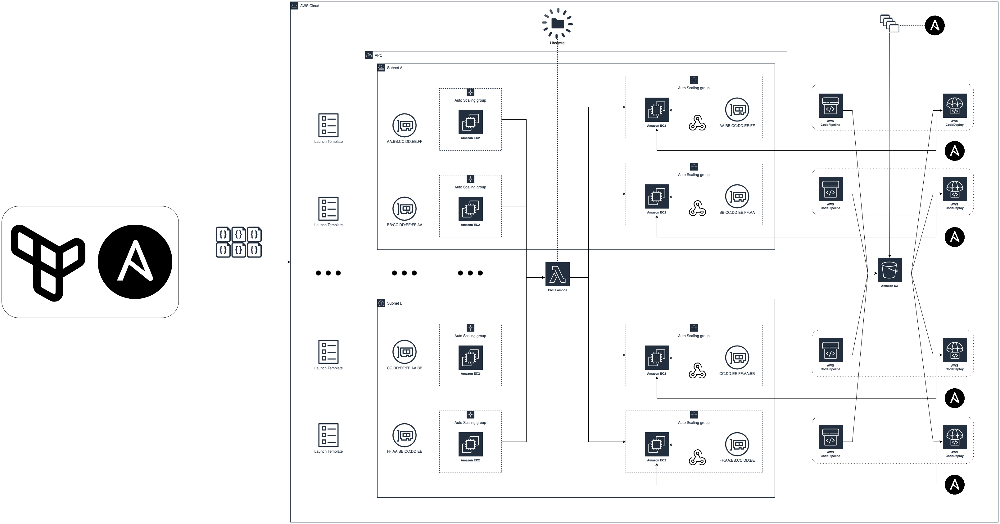

# Automated EC2 Depoyment using CI/CD Pipelines, with MAC Preservation and Auto-Healing  
<br/>
<br/>


## Solution Diagram



## Description
The following solution configures dynamically configure CICD pipelines to deploy EC2 instances with auto-healing, automated configuration and MAC preservation capabilities.

### Automated Configuration
Each EC2 instance is configured using a dedicated CI CD pipeline that is dynamically created based on the config file located in S3 bucket. The pipeline is trigerred by putting new file into S3 bucket that trigers CodeDeploy to install needed software and/or execute Ansible playbook, additional bash scripts, etc.

### Auto-Healing
Each EC2 instance is deployed using dedicated Autoscaling Group that recreates EC2 instance based o health checking and trigers extra action to configure instance to the same state it was before deletion/malfunction.

### MAC Preservation
For each Auto Scalling group, dedicated Interface is created. This interface is detached from old and attached to new EC2 instance during Auto scalling process - as a result new EC2 instance preserves the same MAC address even after recreation process. This set of actions are executed by intercepting EC2 creation event and runing dedicated Lambda function as a lifecycle webhook.

### Config Validation
Before executing code and building infrastructure, dedicated module is used to validate config file against several conditions. Only positive validation allows solution to be deployed.  

### Compute and Cloud Agnostic
As CodeDeploy service can be used to target EC2, Containers as well as external hosts/virtual machines, this solution can be easily adopted to deploy resources outside AWS domain. 

## Deployment

### Config Parameters

Config file is located in TF directory. Both yaml and json format is allowed, the automation prefers **yaml** when both are present.

- [ ] **DeploymentPrefix**: Prefix to be added to each resource's name. Used to identify resources deployed by this solution, also by using different prefixes, following solution can be deployed more than once in selected acount/region
- [ ] **Region**: AWS Region where solution will be deployed (used as a parameter in AWS provider confiuration)
- [ ] **AuthTags**: Additional tags added to compute resources: EC2s and Lambdas&emsp;
- [ ] **Networking:VPCID**: VPC ID where solution is deployed
- [ ] **Networking:SUBNETS_ID**: List of subnets where individual EC2 and network interfaces are created. Subnets must be a part of VPC defined using VPCID parameter. Each list item must provide:  
&emsp;&emsp;&emsp;**Name**: Subnet name to be used to Interface mapping  
&emsp;&emsp;&emsp;**IDs**: Subnet ID
- [ ] **Template:KeyName**: Credentials used to connect to EC2s via ssh
- [ ] **Template:InstanceType**: Instance type used to create EC2 instances
- [ ] **Template:AmiSSMLocation**: AMI location defined via SSM Parameter Store
- [ ] **Template:UseCodeDeployVPCEndpoints**: Define if connectivity with CodeDeploy service is provided via public adresses or use private connectivity via VPC Endpoints. If latter, VPC eodpoint *com.amazonaws.<Region>.codedeploy-commands-secure* must be created.  
- [ ] **Template:SecurityGroups**: List of ingress security group rules. Each list item must provide:  
&emsp;&emsp;&emsp;**Port**: Destination port   
&emsp;&emsp;&emsp;**Proto**: Protocol (TCP/UDP)    
&emsp;&emsp;&emsp;**From**: Source CIDR    
&emsp;&emsp;&emsp;**Description**: Short description of the rule  
- [ ] **Template:Interfaces**: List of Elastic Network Interfaces to be created and attached to individual EC2 instances. Each list item must provide:  
&emsp;&emsp;&emsp;**Name**: Interface name - must be unique   
&emsp;&emsp;&emsp;**MapToSubnet**: Subnet where interface is deployed - must match one of the names defined in Networking:Subnets_IDS section   


### Config Validation
Before applying changes, terraform executes module to verify config file, including:
- [ ] Check if VPC exists
- [ ] Check if all defined subnets belog to defined VPC
- [ ] Check if defined subnet names are unique
- [ ] Check if defined subnet IDs are unique
- [ ] Check if interfaces are mapped to previously defined subnets

__All above conditions must be meet to apply Terraform code.__  
<br/>

## Config Files  
<br/>

***config.yaml***
```yaml
Parameters:

  DeploymentPrefix: "Radkowski-LAB"
  Region: eu-central-1

  AuthTags:
    Owner: "my_email_is@slightly.different"
    Security: "Approved"
  
  Networking:
    VPCID: "vpc-0dec78984xxxxxxxx"
    SUBNETS_IDS: 
      - 
        Name: "SubnetA"
        ID: "subnet-049d72212xxxxxxxx"
      - 
        Name: "SubnetB"
        ID: "subnet-09f5697b3xxxxxxxx"

  Template:
      KeyName: "Radkowski-Lab-Key"
      InstanceType: "t4g.nano"
      AmiSSMLocation: "/aws/service/ami-amazon-linux-latest/amzn2-ami-hvm-arm64-gp2"
      UseCodeDeployVPCEndpoints: True
      SecurityGroups:
        - 
          Port: 12340
          Proto: tcp
          From: "10.0.0.0/16"
          Description: "Example 1: TCP port"
        - 
          Port: 4321
          Proto: tcp
          From: "172.16.0.0/24"
          Description: "Example 2: TCP port"
        - 
          Port: 4343
          Proto: udp
          From: "192.168.0.0/25"
          Description: "Example 3: UDP proto"
        - 
          Port: 22
          Proto: tcp
          From: "0.0.0.0/0"
          Description: "Example 4: ssh access"

  Interfaces:
    - 
      Name: "eni-0"
      MapToSubnet: "SubnetA"
    - 
      Name: "eni-1"
      MapToSubnet: "SubnetB"
```
<br/>

***config.json***   
```json
{
  "Parameters": {
    "DeploymentPrefix": "Radkowski-LAB",
    "Region": "eu-central-1",
    "AuthTags": {
      "Owner": "my.email.is@slightly.different",
      "Security": "Approved"
    },
    "Networking": {
      "VPCID": "vpc-0dec78984xxxxxxxx",
      "SUBNETS_IDS": [
        {
          "Name": "SubnetA",
          "ID": "subnet-049d72212xxxxxxxx"
        },
        {
          "Name": "SubnetB",
          "ID": "subnet-09f5697b3xxxxxxxx"
        }
      ]
    },
    "Template": {
      "KeyName": "Radkowski-Lab-Key",
      "InstanceType": "t4g.nano",
      "AmiSSMLocation": "/aws/service/ami-amazon-linux-latest/amzn2-ami-hvm-arm64-gp2",
      "UseCodeDeployVPCEndpoints": true,
      "SecurityGroups": [
        {
          "Port": 12340,
          "Proto": "tcp",
          "From": "10.0.0.0/16",
          "Description": "Example 1: TCP port"
        },
        {
          "Port": 4321,
          "Proto": "tcp",
          "From": "172.16.0.0/24",
          "Description": "Example 2: TCP port"
        },
        {
          "Port": 4343,
          "Proto": "udp",
          "From": "192.168.0.0/25",
          "Description": "Example 3: UDP proto"
        },
        {
          "Port": 22,
          "Proto": "tcp",
          "From": "0.0.0.0/0",
          "Description": "Example 4: ssh access"
        }
      ]
    },
    "Interfaces": [
      {
        "Name": "eni-0",
        "MapToSubnet": "SubnetA"
      },
      {
        "Name": "eni-1",
        "MapToSubnet": "SubnetB"
      }
    ]
  }
}
```
## Static Code Analysis  
Following code has been scanned using checkov.io - comprehensive tool that includes more than 750 predefined policies to check for common misconfiguration issues as well as security and compliance problems.

```yaml
                   
       _               _              
   ___| |__   ___  ___| | _______   __
  / __| '_ \ / _ \/ __| |/ / _ \ \ / /
 | (__| | | |  __/ (__|   < (_) \ V / 
  \___|_| |_|\___|\___|_|\_\___/ \_/  
                                      
By Prisma Cloud | version: 3.2.17 

terraform scan results:

Passed checks: 44, Failed checks: 0, Skipped checks: 15

Check: CKV_AWS_153: "Autoscaling groups should supply tags to launch configurations"
    PASSED for resource: module.ASG.aws_autoscaling_group.asg
    File: /asg/asg.tf:19-48
    Calling File: /main.tf:43-48
    Guide: https://docs.prismacloud.io/en/enterprise-edition/policy-reference/aws-policies/aws-general-policies/autoscaling-groups-should-supply-tags-to-launch-configurations
Check: CKV_AWS_315: "Ensure EC2 Auto Scaling groups use EC2 launch templates"
    PASSED for resource: module.ASG.aws_autoscaling_group.asg
    File: /asg/asg.tf:19-48
    Calling File: /main.tf:43-48
    Guide: https://docs.prismacloud.io/en/enterprise-edition/policy-reference/aws-policies/aws-general-policies/bc-aws-315
Check: CKV_AWS_66: "Ensure that CloudWatch Log Group specifies retention days"
    PASSED for resource: module.ASG.aws_cloudwatch_log_group.asg-logs
    File: /asg/asg.tf:69-73
    Calling File: /main.tf:43-48
    Guide: https://docs.prismacloud.io/en/enterprise-edition/policy-reference/aws-policies/aws-logging-policies/logging-13
Check: CKV_AWS_338: "Ensure CloudWatch log groups retains logs for at least 1 year"
    PASSED for resource: module.ASG.aws_cloudwatch_log_group.asg-logs
    File: /asg/asg.tf:69-73
    Calling File: /main.tf:43-48
    Guide: https://docs.prismacloud.io/en/enterprise-edition/policy-reference/aws-policies/aws-logging-policies/bc-aws-338
Check: CKV_AWS_364: "Ensure that AWS Lambda function permissions delegated to AWS services are limited by SourceArn or SourceAccount"
    PASSED for resource: module.ASG.aws_lambda_permission.allow_cloudwatch
    File: /asg/asg.tf:75-81
    Calling File: /main.tf:43-48
    Guide: https://docs.prismacloud.io/en/enterprise-edition/policy-reference/aws-policies/aws-iam-policies/bc-aws-364
Check: CKV_AWS_301: "Ensure that AWS Lambda function is not publicly accessible"
    PASSED for resource: module.ASG.aws_lambda_permission.allow_cloudwatch
    File: /asg/asg.tf:75-81
    Calling File: /main.tf:43-48
    Guide: https://docs.prismacloud.io/en/enterprise-edition/policy-reference/aws-policies/aws-general-policies/bc-aws-301
Check: CKV_AWS_93: "Ensure S3 bucket policy does not lockout all but root user. (Prevent lockouts needing root account fixes)"
    PASSED for resource: module.CICD.aws_s3_bucket.s3-buckets
    File: /cicd/cicd.tf:29-38
    Calling File: /main.tf:50-55
    Guide: https://docs.prismacloud.io/en/enterprise-edition/policy-reference/aws-policies/s3-policies/bc-aws-s3-24
Check: CKV_AWS_53: "Ensure S3 bucket has block public ACLS enabled"
    PASSED for resource: module.CICD.aws_s3_bucket_public_access_block.block_public_access
    File: /cicd/cicd.tf:48-55
    Calling File: /main.tf:50-55
    Guide: https://docs.prismacloud.io/en/enterprise-edition/policy-reference/aws-policies/s3-policies/bc-aws-s3-19
Check: CKV_AWS_54: "Ensure S3 bucket has block public policy enabled"
    PASSED for resource: module.CICD.aws_s3_bucket_public_access_block.block_public_access
    File: /cicd/cicd.tf:48-55
    Calling File: /main.tf:50-55
    Guide: https://docs.prismacloud.io/en/enterprise-edition/policy-reference/aws-policies/s3-policies/bc-aws-s3-20
Check: CKV_AWS_55: "Ensure S3 bucket has ignore public ACLs enabled"
    PASSED for resource: module.CICD.aws_s3_bucket_public_access_block.block_public_access
    File: /cicd/cicd.tf:48-55
    Calling File: /main.tf:50-55
    Guide: https://docs.prismacloud.io/en/enterprise-edition/policy-reference/aws-policies/s3-policies/bc-aws-s3-21
Check: CKV_AWS_56: "Ensure S3 bucket has 'restrict_public_buckets' enabled"
    PASSED for resource: module.CICD.aws_s3_bucket_public_access_block.block_public_access
    File: /cicd/cicd.tf:48-55
    Calling File: /main.tf:50-55
    Guide: https://docs.prismacloud.io/en/enterprise-edition/policy-reference/aws-policies/s3-policies/bc-aws-s3-22
Check: CKV_AWS_274: "Disallow IAM roles, users, and groups from using the AWS AdministratorAccess policy"
    PASSED for resource: module.CICD.aws_iam_role.eventbridge-role
    File: /cicd/cicd.tf:57-88
    Calling File: /main.tf:50-55
    Guide: https://docs.prismacloud.io/en/enterprise-edition/policy-reference/aws-policies/aws-iam-policies/bc-aws-274
Check: CKV_AWS_61: "Ensure AWS IAM policy does not allow assume role permission across all services"
    PASSED for resource: module.CICD.aws_iam_role.eventbridge-role
    File: /cicd/cicd.tf:57-88
    Calling File: /main.tf:50-55
    Guide: https://docs.prismacloud.io/en/enterprise-edition/policy-reference/aws-policies/aws-iam-policies/bc-aws-iam-45
Check: CKV_AWS_60: "Ensure IAM role allows only specific services or principals to assume it"
    PASSED for resource: module.CICD.aws_iam_role.eventbridge-role
    File: /cicd/cicd.tf:57-88
    Calling File: /main.tf:50-55
    Guide: https://docs.prismacloud.io/en/enterprise-edition/policy-reference/aws-policies/aws-iam-policies/bc-aws-iam-44
Check: CKV_AWS_274: "Disallow IAM roles, users, and groups from using the AWS AdministratorAccess policy"
    PASSED for resource: module.CICD.aws_iam_role.codedeploy-role
    File: /cicd/cicd.tf:90-129
    Calling File: /main.tf:50-55
    Guide: https://docs.prismacloud.io/en/enterprise-edition/policy-reference/aws-policies/aws-iam-policies/bc-aws-274
Check: CKV_AWS_61: "Ensure AWS IAM policy does not allow assume role permission across all services"
    PASSED for resource: module.CICD.aws_iam_role.codedeploy-role
    File: /cicd/cicd.tf:90-129
    Calling File: /main.tf:50-55
    Guide: https://docs.prismacloud.io/en/enterprise-edition/policy-reference/aws-policies/aws-iam-policies/bc-aws-iam-45
Check: CKV_AWS_60: "Ensure IAM role allows only specific services or principals to assume it"
    PASSED for resource: module.CICD.aws_iam_role.codedeploy-role
    File: /cicd/cicd.tf:90-129
    Calling File: /main.tf:50-55
    Guide: https://docs.prismacloud.io/en/enterprise-edition/policy-reference/aws-policies/aws-iam-policies/bc-aws-iam-44
Check: CKV_AWS_274: "Disallow IAM roles, users, and groups from using the AWS AdministratorAccess policy"
    PASSED for resource: module.CICD.aws_iam_role.codepipeline-role
    File: /cicd/cicd.tf:131-322
    Calling File: /main.tf:50-55
    Guide: https://docs.prismacloud.io/en/enterprise-edition/policy-reference/aws-policies/aws-iam-policies/bc-aws-274
Check: CKV_AWS_61: "Ensure AWS IAM policy does not allow assume role permission across all services"
    PASSED for resource: module.CICD.aws_iam_role.codepipeline-role
    File: /cicd/cicd.tf:131-322
    Calling File: /main.tf:50-55
    Guide: https://docs.prismacloud.io/en/enterprise-edition/policy-reference/aws-policies/aws-iam-policies/bc-aws-iam-45
Check: CKV_AWS_60: "Ensure IAM role allows only specific services or principals to assume it"
    PASSED for resource: module.CICD.aws_iam_role.codepipeline-role
    File: /cicd/cicd.tf:131-322
    Calling File: /main.tf:50-55
    Guide: https://docs.prismacloud.io/en/enterprise-edition/policy-reference/aws-policies/aws-iam-policies/bc-aws-iam-44
Check: CKV_AWS_274: "Disallow IAM roles, users, and groups from using the AWS AdministratorAccess policy"
    PASSED for resource: module.LAMBDA-WEBHOOK.aws_iam_role.lambda-role
    File: /lambda-webhook/lambda-webhook.tf:9-59
    Calling File: /main.tf:35-40
    Guide: https://docs.prismacloud.io/en/enterprise-edition/policy-reference/aws-policies/aws-iam-policies/bc-aws-274
Check: CKV_AWS_61: "Ensure AWS IAM policy does not allow assume role permission across all services"
    PASSED for resource: module.LAMBDA-WEBHOOK.aws_iam_role.lambda-role
    File: /lambda-webhook/lambda-webhook.tf:9-59
    Calling File: /main.tf:35-40
    Guide: https://docs.prismacloud.io/en/enterprise-edition/policy-reference/aws-policies/aws-iam-policies/bc-aws-iam-45
Check: CKV_AWS_60: "Ensure IAM role allows only specific services or principals to assume it"
    PASSED for resource: module.LAMBDA-WEBHOOK.aws_iam_role.lambda-role
    File: /lambda-webhook/lambda-webhook.tf:9-59
    Calling File: /main.tf:35-40
    Guide: https://docs.prismacloud.io/en/enterprise-edition/policy-reference/aws-policies/aws-iam-policies/bc-aws-iam-44
Check: CKV_AWS_363: "Ensure Lambda Runtime is not deprecated"
    PASSED for resource: module.LAMBDA-WEBHOOK.aws_lambda_function.webhook-lambda-exec
    File: /lambda-webhook/lambda-webhook.tf:145-163
    Calling File: /main.tf:35-40
    Guide: https://docs.prismacloud.io/en/enterprise-edition/policy-reference/aws-policies/aws-general-policies/bc-aws-363
Check: CKV_AWS_45: "Ensure no hard-coded secrets exist in lambda environment"
    PASSED for resource: module.LAMBDA-WEBHOOK.aws_lambda_function.webhook-lambda-exec
    File: /lambda-webhook/lambda-webhook.tf:145-163
    Calling File: /main.tf:35-40
    Guide: https://docs.prismacloud.io/en/enterprise-edition/policy-reference/aws-policies/secrets-policies/bc-aws-secrets-3
Check: CKV_AWS_66: "Ensure that CloudWatch Log Group specifies retention days"
    PASSED for resource: module.LAMBDA-WEBHOOK.aws_cloudwatch_log_group.lambda-logs
    File: /lambda-webhook/lambda-webhook.tf:165-169
    Calling File: /main.tf:35-40
    Guide: https://docs.prismacloud.io/en/enterprise-edition/policy-reference/aws-policies/aws-logging-policies/logging-13
Check: CKV_AWS_338: "Ensure CloudWatch log groups retains logs for at least 1 year"
    PASSED for resource: module.LAMBDA-WEBHOOK.aws_cloudwatch_log_group.lambda-logs
    File: /lambda-webhook/lambda-webhook.tf:165-169
    Calling File: /main.tf:35-40
    Guide: https://docs.prismacloud.io/en/enterprise-edition/policy-reference/aws-policies/aws-logging-policies/bc-aws-338
Check: CKV_AWS_274: "Disallow IAM roles, users, and groups from using the AWS AdministratorAccess policy"
    PASSED for resource: module.LAUNCH-TEMPLATE.aws_iam_role.instance-profile-role
    File: /launch-template/templates.tf:25-70
    Calling File: /main.tf:24-33
    Guide: https://docs.prismacloud.io/en/enterprise-edition/policy-reference/aws-policies/aws-iam-policies/bc-aws-274
Check: CKV_AWS_61: "Ensure AWS IAM policy does not allow assume role permission across all services"
    PASSED for resource: module.LAUNCH-TEMPLATE.aws_iam_role.instance-profile-role
    File: /launch-template/templates.tf:25-70
    Calling File: /main.tf:24-33
    Guide: https://docs.prismacloud.io/en/enterprise-edition/policy-reference/aws-policies/aws-iam-policies/bc-aws-iam-45
Check: CKV_AWS_60: "Ensure IAM role allows only specific services or principals to assume it"
    PASSED for resource: module.LAUNCH-TEMPLATE.aws_iam_role.instance-profile-role
    File: /launch-template/templates.tf:25-70
    Calling File: /main.tf:24-33
    Guide: https://docs.prismacloud.io/en/enterprise-edition/policy-reference/aws-policies/aws-iam-policies/bc-aws-iam-44
Check: CKV_AWS_79: "Ensure Instance Metadata Service Version 1 is not enabled"
    PASSED for resource: module.LAUNCH-TEMPLATE.aws_launch_template.lic-server-template
    File: /launch-template/templates.tf:79-106
    Calling File: /main.tf:24-33
    Guide: https://docs.prismacloud.io/en/enterprise-edition/policy-reference/aws-policies/aws-general-policies/bc-aws-general-31
Check: CKV_AWS_88: "EC2 instance should not have public IP."
    PASSED for resource: module.LAUNCH-TEMPLATE.aws_launch_template.lic-server-template
    File: /launch-template/templates.tf:79-106
    Calling File: /main.tf:24-33
    Guide: https://docs.prismacloud.io/en/enterprise-edition/policy-reference/aws-policies/public-policies/public-12
Check: CKV_AWS_46: "Ensure no hard-coded secrets exist in EC2 user data"
    PASSED for resource: module.LAUNCH-TEMPLATE.aws_launch_template.lic-server-template
    File: /launch-template/templates.tf:79-106
    Calling File: /main.tf:24-33
    Guide: https://docs.prismacloud.io/en/enterprise-edition/policy-reference/aws-policies/secrets-policies/bc-aws-secrets-1
Check: CKV_AWS_341: "Ensure Launch template should not have a metadata response hop limit greater than 1"
    PASSED for resource: module.LAUNCH-TEMPLATE.aws_launch_template.lic-server-template
    File: /launch-template/templates.tf:79-106
    Calling File: /main.tf:24-33
    Guide: https://docs.prismacloud.io/en/enterprise-edition/policy-reference/aws-policies/aws-general-policies/bc-aws-341
Check: CKV_AWS_260: "Ensure no security groups allow ingress from 0.0.0.0:0 to port 80"
    PASSED for resource: module.SECURITY-GROUPS.aws_security_group.lic-server-sg
    File: /security-groups/sg.tf:6-38
    Calling File: /main.tf:7-13
    Guide: https://docs.prismacloud.io/en/enterprise-edition/policy-reference/aws-policies/aws-networking-policies/ensure-aws-security-groups-do-not-allow-ingress-from-00000-to-port-80
Check: CKV_AWS_24: "Ensure no security groups allow ingress from 0.0.0.0:0 to port 22"
    PASSED for resource: module.SECURITY-GROUPS.aws_security_group.lic-server-sg
    File: /security-groups/sg.tf:6-38
    Calling File: /main.tf:7-13
    Guide: https://docs.prismacloud.io/en/enterprise-edition/policy-reference/aws-policies/aws-networking-policies/networking-1-port-security
Check: CKV_AWS_23: "Ensure every security groups rule has a description"
    PASSED for resource: module.SECURITY-GROUPS.aws_security_group.lic-server-sg
    File: /security-groups/sg.tf:6-38
    Calling File: /main.tf:7-13
    Guide: https://docs.prismacloud.io/en/enterprise-edition/policy-reference/aws-policies/aws-networking-policies/networking-31
Check: CKV_AWS_277: "Ensure no security groups allow ingress from 0.0.0.0:0 to port -1"
    PASSED for resource: module.SECURITY-GROUPS.aws_security_group.lic-server-sg
    File: /security-groups/sg.tf:6-38
    Calling File: /main.tf:7-13
    Guide: https://docs.prismacloud.io/en/enterprise-edition/policy-reference/aws-policies/aws-networking-policies/ensure-aws-security-group-does-not-allow-all-traffic-on-all-ports
Check: CKV_AWS_25: "Ensure no security groups allow ingress from 0.0.0.0:0 to port 3389"
    PASSED for resource: module.SECURITY-GROUPS.aws_security_group.lic-server-sg
    File: /security-groups/sg.tf:6-38
    Calling File: /main.tf:7-13
    Guide: https://docs.prismacloud.io/en/enterprise-edition/policy-reference/aws-policies/aws-networking-policies/networking-2
Check: CKV_AWS_20: "S3 Bucket has an ACL defined which allows public READ access."
    PASSED for resource: module.CICD.aws_s3_bucket.s3-buckets
    File: /cicd/cicd.tf:29-38
    Guide: https://docs.prismacloud.io/en/enterprise-edition/policy-reference/aws-policies/s3-policies/s3-1-acl-read-permissions-everyone
Check: CKV_AWS_57: "S3 Bucket has an ACL defined which allows public WRITE access."
    PASSED for resource: module.CICD.aws_s3_bucket.s3-buckets
    File: /cicd/cicd.tf:29-38
    Guide: https://docs.prismacloud.io/en/enterprise-edition/policy-reference/aws-policies/s3-policies/s3-2-acl-write-permissions-everyone
Check: CKV2_AWS_6: "Ensure that S3 bucket has a Public Access block"
    PASSED for resource: module.CICD.aws_s3_bucket.s3-buckets
    File: /cicd/cicd.tf:29-38
    Guide: https://docs.prismacloud.io/en/enterprise-edition/policy-reference/aws-policies/aws-networking-policies/s3-bucket-should-have-public-access-blocks-defaults-to-false-if-the-public-access-block-is-not-attached
Check: CKV_AWS_19: "Ensure all data stored in the S3 bucket is securely encrypted at rest"
    PASSED for resource: module.CICD.aws_s3_bucket.s3-buckets
    File: /cicd/cicd.tf:29-38
    Guide: https://docs.prismacloud.io/en/enterprise-edition/policy-reference/aws-policies/s3-policies/s3-14-data-encrypted-at-rest
Check: CKV_AWS_21: "Ensure all data stored in the S3 bucket have versioning enabled"
    PASSED for resource: module.CICD.aws_s3_bucket.s3-buckets
    File: /cicd/cicd.tf:29-38
    Guide: https://docs.prismacloud.io/en/enterprise-edition/policy-reference/aws-policies/s3-policies/s3-16-enable-versioning
Check: CKV_AWS_158: "Ensure that CloudWatch Log Group is encrypted by KMS"
    SKIPPED for resource: module.ASG.aws_cloudwatch_log_group.asg-logs
    Suppress comment: The log group is intentionaly not encrypted using KMS
    File: /asg/asg.tf:69-73
    Calling File: /main.tf:43-48
    Guide: https://docs.prismacloud.io/en/enterprise-edition/policy-reference/aws-policies/aws-general-policies/ensure-that-cloudwatch-log-group-is-encrypted-by-kms
Check: CKV_AWS_219: "Ensure CodePipeline Artifact store is using a KMS CMK"
    SKIPPED for resource: module.CICD.aws_codepipeline.codepipeline
    Suppress comment: No need for KMS encryption for Artifact Store
    File: /cicd/cicd.tf:350-394
    Calling File: /main.tf:50-55
    Guide: https://docs.prismacloud.io/en/enterprise-edition/policy-reference/aws-policies/aws-general-policies/ensure-aws-codepipeline-artifactstore-is-not-encrypted-by-key-management-service-kms-using-a-customer-managed-key-cmk
Check: CKV_AWS_50: "X-Ray tracing is enabled for Lambda"
    SKIPPED for resource: module.LAMBDA-WEBHOOK.aws_lambda_function.webhook-lambda-exec
    Suppress comment: No X-Ray tracing needed
    File: /lambda-webhook/lambda-webhook.tf:145-163
    Calling File: /main.tf:35-40
    Guide: https://docs.prismacloud.io/en/enterprise-edition/policy-reference/aws-policies/aws-serverless-policies/bc-aws-serverless-4
Check: CKV_AWS_117: "Ensure that AWS Lambda function is configured inside a VPC"
    SKIPPED for resource: module.LAMBDA-WEBHOOK.aws_lambda_function.webhook-lambda-exec
    Suppress comment: Lambda intentionaly deployed outside solution VPC
    File: /lambda-webhook/lambda-webhook.tf:145-163
    Calling File: /main.tf:35-40
    Guide: https://docs.prismacloud.io/en/enterprise-edition/policy-reference/aws-policies/aws-general-policies/ensure-that-aws-lambda-function-is-configured-inside-a-vpc-1
Check: CKV_AWS_116: "Ensure that AWS Lambda function is configured for a Dead Letter Queue(DLQ)"
    SKIPPED for resource: module.LAMBDA-WEBHOOK.aws_lambda_function.webhook-lambda-exec
    Suppress comment: Lambda intentionaly deployed without concurent execution limit
    File: /lambda-webhook/lambda-webhook.tf:145-163
    Calling File: /main.tf:35-40
    Guide: https://docs.prismacloud.io/en/enterprise-edition/policy-reference/aws-policies/aws-general-policies/ensure-that-aws-lambda-function-is-configured-for-a-dead-letter-queue-dlq
Check: CKV_AWS_272: "Ensure AWS Lambda function is configured to validate code-signing"
    SKIPPED for resource: module.LAMBDA-WEBHOOK.aws_lambda_function.webhook-lambda-exec
    Suppress comment: No code-signing required
    File: /lambda-webhook/lambda-webhook.tf:145-163
    Calling File: /main.tf:35-40
    Guide: https://docs.prismacloud.io/en/enterprise-edition/policy-reference/aws-policies/aws-general-policies/bc-aws-272
Check: CKV_AWS_115: "Ensure that AWS Lambda function is configured for function-level concurrent execution limit"
    SKIPPED for resource: module.LAMBDA-WEBHOOK.aws_lambda_function.webhook-lambda-exec
    Suppress comment: Lambda intentionaly deployed without concurent execution limit
    File: /lambda-webhook/lambda-webhook.tf:145-163
    Calling File: /main.tf:35-40
    Guide: https://docs.prismacloud.io/en/enterprise-edition/policy-reference/aws-policies/aws-general-policies/ensure-that-aws-lambda-function-is-configured-for-function-level-concurrent-execution-limit
Check: CKV_AWS_158: "Ensure that CloudWatch Log Group is encrypted by KMS"
    SKIPPED for resource: module.LAMBDA-WEBHOOK.aws_cloudwatch_log_group.lambda-logs
    Suppress comment: The log group is intentionaly not encrypted using KMS
    File: /lambda-webhook/lambda-webhook.tf:165-169
    Calling File: /main.tf:35-40
    Guide: https://docs.prismacloud.io/en/enterprise-edition/policy-reference/aws-policies/aws-general-policies/ensure-that-cloudwatch-log-group-is-encrypted-by-kms
Check: CKV_AWS_41: "Ensure no hard coded AWS access key and secret key exists in provider"
    SKIPPED for resource: aws.default
    Suppress comment: No credentials hardcoded into provider block
    File: /provider.tf:11-18
    Guide: https://docs.prismacloud.io/en/enterprise-edition/policy-reference/aws-policies/secrets-policies/bc-aws-secrets-5
Check: CKV2_AWS_5: "Ensure that Security Groups are attached to another resource"
    SKIPPED for resource: module.SECURITY-GROUPS.aws_security_group.lic-server-sg
    Suppress comment: Security Group is attached to the resource located in separate module
    File: /security-groups/sg.tf:6-38
    Guide: https://docs.prismacloud.io/en/enterprise-edition/policy-reference/aws-policies/aws-networking-policies/ensure-that-security-groups-are-attached-to-ec2-instances-or-elastic-network-interfaces-enis
Check: CKV2_AWS_62: "Ensure S3 buckets should have event notifications enabled"
    SKIPPED for resource: module.CICD.aws_s3_bucket.s3-buckets
    Suppress comment: No event notification needed
    File: /cicd/cicd.tf:29-38
    Guide: https://docs.prismacloud.io/en/enterprise-edition/policy-reference/aws-policies/aws-logging-policies/bc-aws-2-62
Check: CKV2_AWS_61: "Ensure that an S3 bucket has a lifecycle configuration"
    SKIPPED for resource: module.CICD.aws_s3_bucket.s3-buckets
    Suppress comment: No lifecycle configuration needed
    File: /cicd/cicd.tf:29-38
    Guide: https://docs.prismacloud.io/en/enterprise-edition/policy-reference/aws-policies/aws-logging-policies/bc-aws-2-61
Check: CKV_AWS_145: "Ensure that S3 buckets are encrypted with KMS by default"
    SKIPPED for resource: module.CICD.aws_s3_bucket.s3-buckets
    Suppress comment: No KMS encryption needed
    File: /cicd/cicd.tf:29-38
    Guide: https://docs.prismacloud.io/en/enterprise-edition/policy-reference/aws-policies/aws-general-policies/ensure-that-s3-buckets-are-encrypted-with-kms-by-default
Check: CKV_AWS_144: "Ensure that S3 bucket has cross-region replication enabled"
    SKIPPED for resource: module.CICD.aws_s3_bucket.s3-buckets
    Suppress comment: No cross-region replication needed
    File: /cicd/cicd.tf:29-38
    Guide: https://docs.prismacloud.io/en/enterprise-edition/policy-reference/aws-policies/aws-general-policies/ensure-that-s3-bucket-has-cross-region-replication-enabled
Check: CKV_AWS_18: "Ensure the S3 bucket has access logging enabled"
    SKIPPED for resource: module.CICD.aws_s3_bucket.s3-buckets
    Suppress comment: No access logging needed
    File: /cicd/cicd.tf:29-38
    Guide: https://docs.prismacloud.io/en/enterprise-edition/policy-reference/aws-policies/s3-policies/s3-13-enable-logging
```

## IaC

<br/>

### Terraform Output
```json
{
    "eni-0": {
        "app_name": "Radkowski-LAB-eni-0-02-d1-32-3c-80-b3-deploy-app",
        "asg_arn": "arn:aws:autoscaling:eu-central-1:123456789012:autoScalingGroup:fcb800dd-450d-480f-8ce2-8aa082fbea05:autoScalingGroupName/Radkowski-LAB-eni-0-02-d1-32-3c-80-b3",
        "asg_id": "Radkowski-LAB-eni-0-02-d1-32-3c-80-b3",
        "asg_tags": [
            {
                "key": "interface_id",
                "propagate_at_launch": true,
                "value": "eni-0a44a62dce9b25d58"
            },
            {
                "key": "interface_mac",
                "propagate_at_launch": true,
                "value": "02:d1:32:3c:80:b3"
            },
            {
                "key": "subnet_id",
                "propagate_at_launch": true,
                "value": "subnet-049d72212xxxxxxxx"
            }
        ],
        "bucket_pipeline_keys ": "radkowski-lab-eni-0-02-d1-32-3c-80-b3/",
        "deployment_group_arn": "arn:aws:codedeploy:eu-central-1:123456789012:deploymentgroup:Radkowski-LAB-eni-0-02-d1-32-3c-80-b3-deploy-app/Radkowski-LAB-eni-0-02-d1-32-3c-80-b3-deploy-group",
        "deployment_group_id": "6366a182-330c-42fb-8e14-135a93af4a85",
        "deployment_group_name": "Radkowski-LAB-eni-0-02-d1-32-3c-80-b3-deploy-group",
        "interface_id": "eni-0a44a62dce9b25d58",
        "interface_mac": "02:d1:32:3c:80:b3",
        "subnet_id": "subnet-049d72212xxxxxxxx",
        "template_arn": "arn:aws:ec2:eu-central-1:123456789012:launch-template/lt-064737dd14ec5b6f2",
        "template_id": "lt-064737dd14ec5b6f2",
        "template_name": "Radkowski-LAB-eni-0-02-d1-32-3c-80-b3"
    },
    "eni-1": {
        "app_name": "Radkowski-LAB-eni-1-06-28-8d-a9-d1-85-deploy-app",
        "asg_arn": "arn:aws:autoscaling:eu-central-1:123456789012:autoScalingGroup:f93370d5-72eb-41ed-8fcc-ed4b98191cf1:autoScalingGroupName/Radkowski-LAB-eni-1-06-28-8d-a9-d1-85",
        "asg_id": "Radkowski-LAB-eni-1-06-28-8d-a9-d1-85",
        "asg_tags": [
            {
                "key": "interface_id",
                "propagate_at_launch": true,
                "value": "eni-0be2c645e60100701"
            },
            {
                "key": "interface_mac",
                "propagate_at_launch": true,
                "value": "06:28:8d:a9:d1:85"
            },
            {
                "key": "subnet_id",
                "propagate_at_launch": true,
                "value": "subnet-09f5697b3xxxxxxxx"
            }
        ],
        "bucket_pipeline_keys ": "radkowski-lab-eni-1-06-28-8d-a9-d1-85/",
        "deployment_group_arn": "arn:aws:codedeploy:eu-central-1:123456789012:deploymentgroup:Radkowski-LAB-eni-1-06-28-8d-a9-d1-85-deploy-app/Radkowski-LAB-eni-1-06-28-8d-a9-d1-85-deploy-group",
        "deployment_group_id": "dabd5ec7-b22c-4a62-8060-5817dd380a3c",
        "deployment_group_name": "Radkowski-LAB-eni-1-06-28-8d-a9-d1-85-deploy-group",
        "interface_id": "eni-0be2c645e60100701",
        "interface_mac": "06:28:8d:a9:d1:85",
        "subnet_id": "subnet-09f5697b3xxxxxxxx",
        "template_arn": "arn:aws:ec2:eu-central-1:123456789012:launch-template/lt-0a612b2fd4d3f3349",
        "template_id": "lt-0a612b2fd4d3f3349",
        "template_name": "Radkowski-LAB-eni-1-06-28-8d-a9-d1-85"
    }
}
```
<br/>


### Lambda Code

```python
import json
import boto3
import os
import time 
import logging


logger = logging.getLogger()
logger.setLevel(logging.INFO)


def collect_interface_status(interface_id):
    interface_details = {}
    client_ec2 = boto3.client('ec2')
    response = client_ec2.describe_network_interfaces(
        NetworkInterfaceIds=[interface_id]
    )    
    interface_details["MacAddress"]= response["NetworkInterfaces"][0]["MacAddress"]
    interface_details["Status"]= response["NetworkInterfaces"][0]["Status"]
    interface_details["SubnetId"]= response["NetworkInterfaces"][0]["SubnetId"]
    return (interface_details)


def attach_interface(instance_id, interface_id):    
    client_ec2 = boto3.client('ec2')
    response = client_ec2.attach_network_interface (
        DeviceIndex=1,
        InstanceId=instance_id,
        NetworkInterfaceId=interface_id)
    return (response)


def all_in_one(instance_id,interface_id):
    no_of_waits = 5
    counter_of_waits = 0
    while collect_interface_status(interface_id)["Status"] != "available":
         print("waiting for interface to be available")
         logger.info ('Interface seems not to be ready to be attached, waiting ... ')
         time.sleep(5)
         counter_of_waits +=1
         logger.info ('Attempt: '+str(counter_of_waits)+'/'+str( no_of_waits))
         if (counter_of_waits > no_of_waits) :
              logger.info ('ACION FAILED !!!')
              return False
    attach_interface(instance_id,interface_id)


def complete_hook(hook_name, asg_name, asg_token):
    client_asg = boto3.client('autoscaling')
    response = client_asg.complete_lifecycle_action(
        LifecycleHookName=hook_name,
        AutoScalingGroupName=asg_name,
        LifecycleActionToken=asg_token,
        LifecycleActionResult='CONTINUE'
    )
    return 0

def lambda_handler(event, context):

    InstanceID = event['detail']['EC2InstanceId']
    NetworkInterfaceID = event['detail']['NotificationMetadata']['interface_id']
    
    logger.info ('Attaching interface: '+str(NetworkInterfaceID)+' to '+str( InstanceID)+' in progress ...')
    
    all_in_one(InstanceID,NetworkInterfaceID)
    logger.info ('Interface successfully attached ')
    
    complete_hook(event['detail']['LifecycleHookName'],event['detail']['AutoScalingGroupName'],event['detail']['LifecycleActionToken'])
    return 0
```


